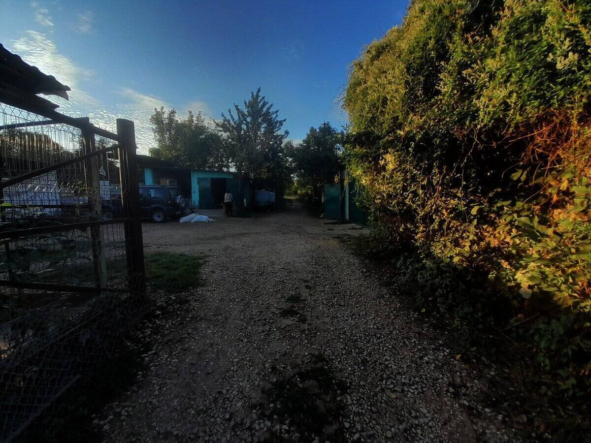
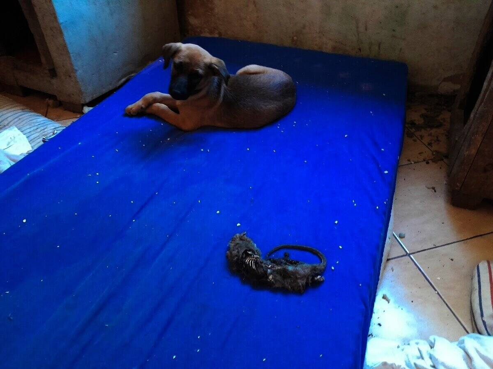
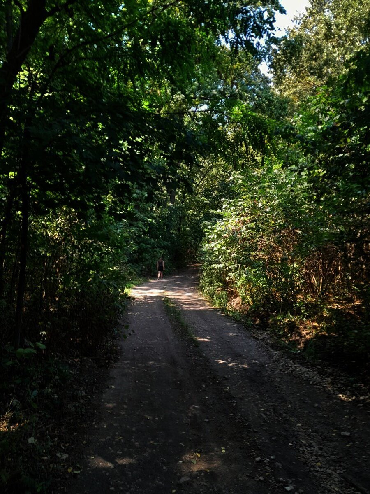
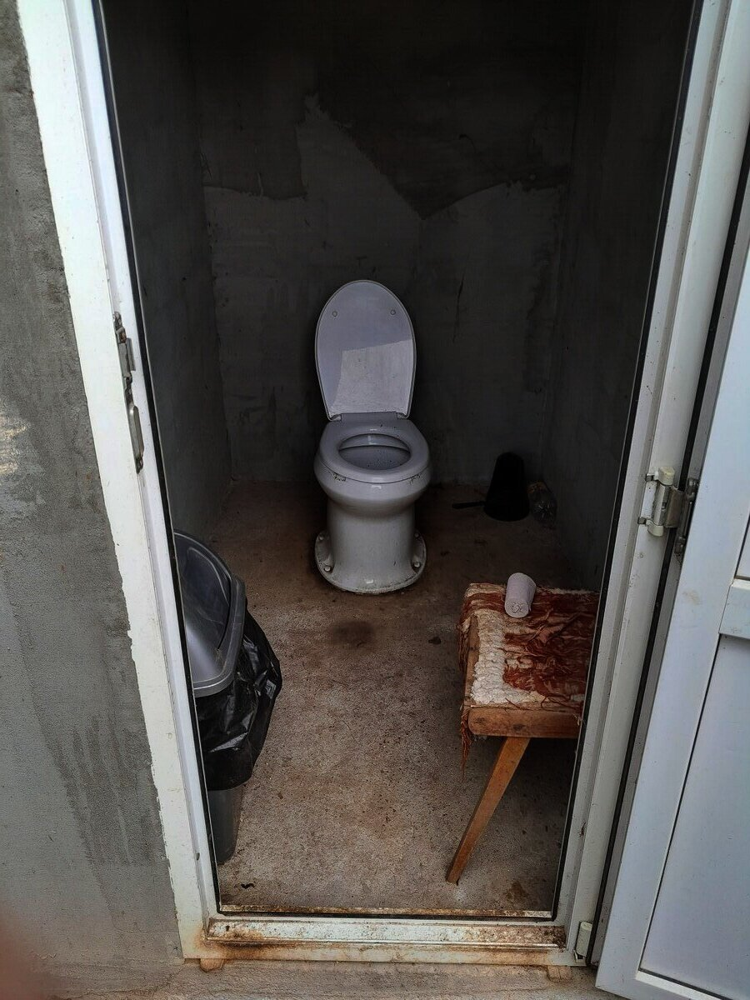
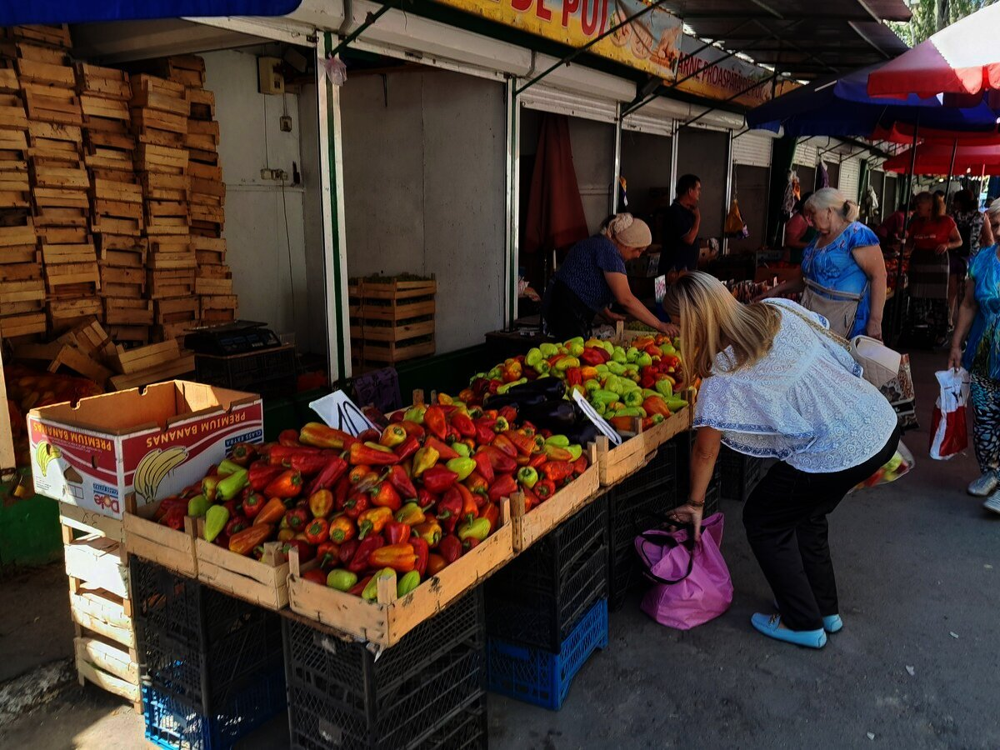
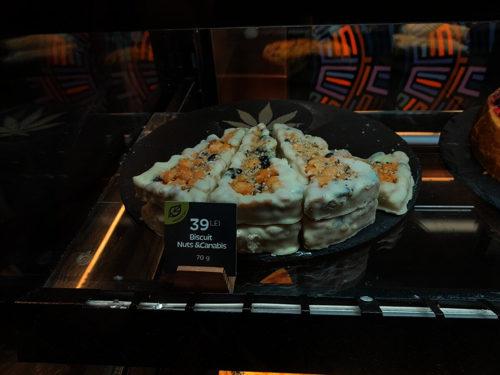
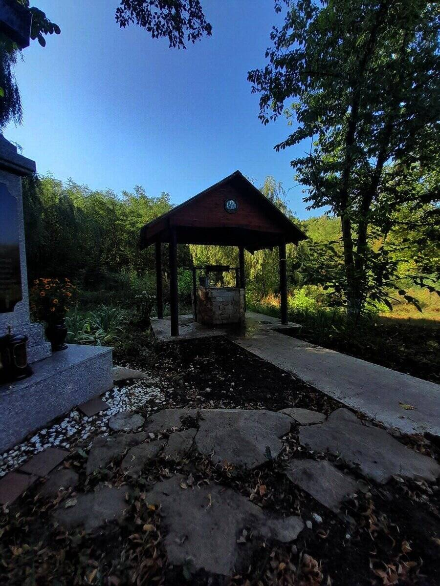
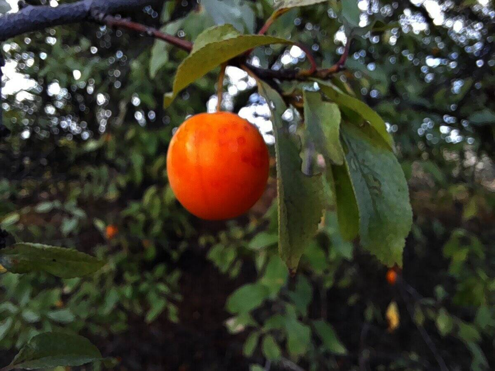
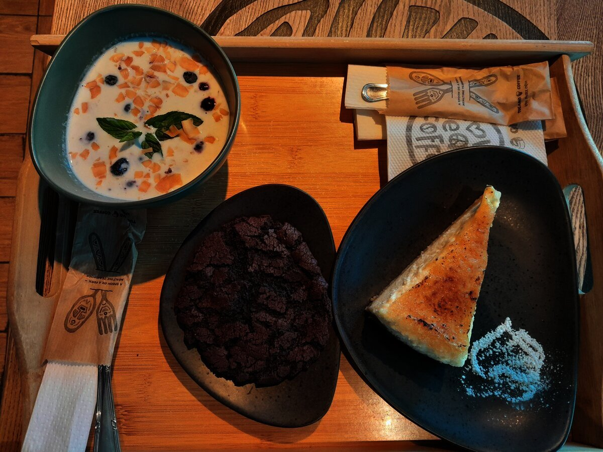

# Volunteering in Animal Shelter

In the summer of 2022, 32 days were spent doing a volunteering in Moldova.
This is an account of the journey, which I dare say to have enjoyed despite the circumstances.
Which by many are said to have been too dangerous as to adventure into travel. Nonetheless, I did not wish
to be coerced by fear, as most civilized society is kept to-day.

 

 

